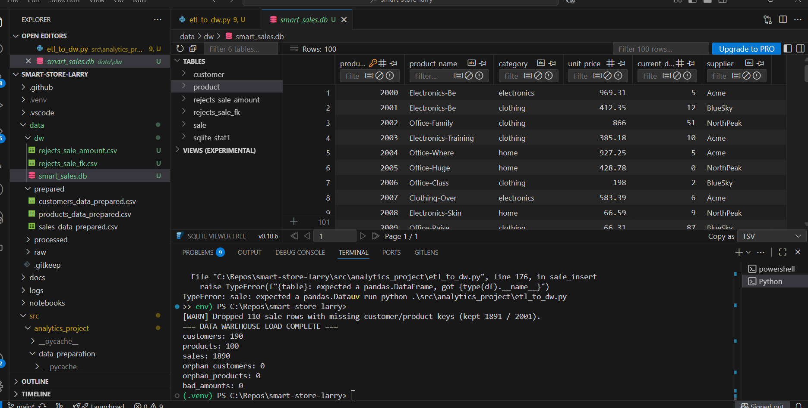
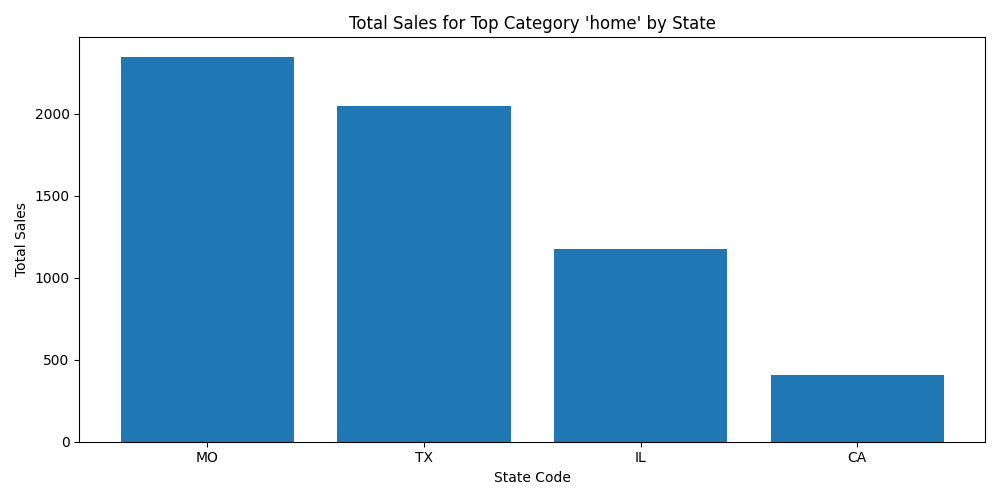
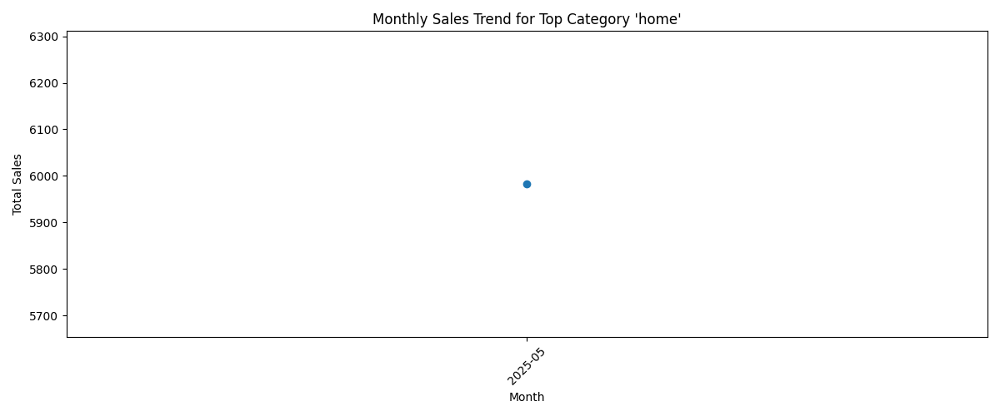

## P4: Data Warehouse (SQLite)

**Design**: Star schema
- **Fact**: `sale(sale_id, transaction_id, sale_date, customer_id, product_id, store_id, campaign_id, sale_amount, discount_pct, state_code)`
- **Dims**:
  - `customer(customer_id, name, country, signup_date, loyalty_points, preferred_contact)`
  - `product(product_id, product_name, category, unit_price, current_discount_pct, supplier)`

**ETL output**: `data/dw/smart_sales.db`
**Row counts** (from script): customers=190, products=100, sales=1890 (110 sale rows dropped for missing FKs)
**Data quality rules**:
- FK integrity (`sale.customer_id` → `customer.customer_id`; `sale.product_id` → `product.product_id`)
- `sale_amount` must be non-null and ≥ 0
- Dates stored as ISO `YYYY-MM-DD` TEXT (SQLite)


# Smart Store BI Reporting – Project P5
Smart Store BI Reporting – Project P5

Author: Sandra Otubushin
Operating System: Windows 11
Tool Used: Power BI Desktop (Windows implementation)

📘 Project Overview

This project continues from P4, where I built a SQLite data warehouse for the Smart Store dataset.
For P5, I loaded the warehouse tables into Power BI Desktop and performed OLAP reporting operations:

Slice (single-dimensional filter)

Dice (multi-dimensional filter)

Drilldown (hierarchical date exploration)

Interactive visualization

Star schema modeling

Because Windows blocked direct SQLite ODBC installation, I exported all warehouse tables to CSV and imported them into Power BI.

📊 Data Sources Used

The following tables were imported from the P4 data warehouse:

customers_data_prepared.csv

products_data_prepared.csv

sales_data_prepared_clean.csv
(cleaned version with corrected dates and numeric saleamount values)

🧩 Data Model (Star Schema)

The fact table sales_data_prepared_clean connects to two dimension tables:

customers_data_prepared       products_data_prepared
          \                           /
           \                         /
            --> sales_data_prepared_clean <--


Relationships:

customers_data_prepared.customer_id → sales_data_prepared_clean.customerid

products_data_prepared.productid → sales_data_prepared_clean.productid

📸 Insert Model View Screenshot Here
🔍 OLAP Operations
1️⃣ Slice Operation

Dimension Used: Product Category
Field: products_data_prepared[category]
Why:
Slicing allows analysis along a single dimension. Filtering by category shows how sales vary across product categories.

Visualization:

Slicer: Product Category

Bar Chart: Sum of saleamount by productname
2️⃣ Dice Operation

Dimensions Used:

Product Category

State Code

Fields:

products_data_prepared[category]

sales_data_prepared_clean[statecode]

Why:
Dicing uses two dimensions together. This reveals patterns such as which states perform best for a given category.

Visualization:

Two slicers: Category + StateCode

Column chart filtered by both slicers

📸 Insert DICE Screenshot Here
3️⃣ Drilldown Operation

Hierarchy Used: SaleDate hierarchy

Year

Quarter

Month

Day

Field: SaleDate.1 (cleaned date column)

Why:
Drilldowns allow deeper exploration of trends over time.
This shows how sales unfold annually, quarterly, and monthly.

Visualization:

Column or Line Chart

X-axis: Date hierarchy

Y-axis: Sum of saleamount

Drilldown enabled (⬇⬇ icon)
## P6 – BI Insights & Storytelling (OLAP Analysis)

This module extends Smart Store reporting by performing OLAP-style slicing, dicing, and drilldown in Python to uncover a business insight that supports a real decision.
All computations were performed on Windows 11 inside a virtual environment.

---

# 1. Business Goal

**Goal:**
Identify the **top-selling product category** and analyze how its sales vary by **state** and by **month**.

**Why this matters:**
Understanding which product category performs best — and where/when it performs best — helps the Smart Store decide how to:
- allocate inventory,
- plan regional advertising,
- optimize seasonal promotions.

The outcome drives **one actionable result**:
📌 *Prioritize the top category in the top-performing states and align inventory to peak seasonal months.*

---

# 2. Data Source

I used the **prepared CSVs** produced in P3–P5 located in `data/prepared/`:

### **Files:**
- `sales_data_prepared_clean.csv`
  (transactionid, productid, customerid, saleamount, SaleDate.1, statecode)
- `products_data_prepared.csv`
  (productid, productname, category)
- `customers_data_prepared.csv`
  (customer_id → renamed to customerid, country, signup_date)

### **Columns Used**
| Purpose | Columns |
|--------|----------|
| Metric | `saleamount` |
| Geography | `statecode` |
| Category | `category` (via join with products table) |
| Time | `SaleDate.1` → converted to `Year`, `Month` |

---

# 3. Tools

- **Windows 11**
- **Python 3** (inside `.venv`)
- **pandas** — used for cube creation, slicing, dicing, drilldown
- **matplotlib** — used for visualizations
- **VS Code** — editing and running scripts

Main OLAP script:

Documentation:

---

# 4. Workflow & OLAP Logic

### **4.1 Preparation**
1. Load all prepared CSVs.
2. Clean and convert fields:
   - `SaleDate.1` → datetime
   - `saleamount` → numeric
3. Merge sales + products (and customers if needed).
4. Create time features:
   - `Year`
   - `Month` (YYYY-MM)

---

### **4.2 Build OLAP Cube**
I grouped the merged dataset by:

category × statecode × Year × Month


And computed:


SUM(saleamount) AS total_sales


The cube was saved as:


---

### **4.3 Slice, Dice, Drilldown**

| OLAP Operation | Description |
|----------------|-------------|
| **Slice** | Filter cube to the **top category** only |
| **Dice** | Analyze the slice by **statecode** |
| **Drilldown** | Group by **Month** to find seasonal trends |

---

# 5. Results & Visualizations

### **Top Category Overall**
From the script output:
**Top Category = home**

---

## 5.1  Visualizations

### Dice Result (Top Category by State)


### Drilldown Result (Monthly Trend)


##   Data Outputs (CSV Files)

- [OLAP Cube CSV](olap/figures/cube_category_state_year_month.csv)
- [Dice Breakdown CSV](olap/figures/dice_top_category_by_state.csv)

# 6. Suggested Business Action

Based on the OLAP findings:

### ✔ Inventory Strategy
Stock more **Home-category** items in high-performing states.

### ✔ Marketing Strategy
Increase advertising in low-performing states to build awareness.

### ✔ Seasonal Strategy
Align promotions and inventory ordering with strong sales months and prepare early for peak seasons.

---

# 7. Challenges

| Issue | How It Was Solved |
|-------|----------------------|
| Invalid date formats (`2023-13-01`) | Dropped/cleaned rows and used `pd.to_datetime` |
| saleamount stored as text | Converted using `pd.to_numeric` |
| Multiple keys (`customer_id` vs `customerid`) | Standardized naming |
| Designing cube dimensions | Built step-by-step with intermediate exports |

---

---

## P7 – Custom BI Project (Custom Decision Support)

All computations were performed on Windows 11 inside a virtual environment using Python and VS Code.

### 1. The Business Goal

**Goal:** Identify the **top-selling product category** and analyze how its sales vary by **country** and by **month** in the most recent full year.

**Why it matters:**
This helps Smart Store decide where to focus **marketing**, **inventory**, and **promotions** for the category that is already performing best, and to see **which regions and months** drive that success.

---

### 2. Data Source

**Primary table:** `data/prepared/sales_data_prepared.csv`

Columns used:

- `saledate` – sale transaction date
- `saleamount` – revenue per transaction
- `discountpct` – discount percentage
- `storeid` – store identifier
- `campaignid` – campaign identifier
- `productid` – product identifier

Joined with:

- `data/prepared/products_data_prepared.csv`
  - `productid`, `productname`, `category`

- `data/prepared/customers_data_prepared.csv`
  - `customer_id`, `country`, `signup_date`

The P7 script reads the **prepared** sales table and joins to product and customer tables to enrich each sale with **category** and **country**.

---

### 3. Tools Used

- **Python 3** (inside `.venv`)
- **pandas** – data loading and aggregation
- **matplotlib** – charts
- **VS Code on Windows 11** – editing and running scripts
- **Git + GitHub** – version control

Custom analysis script:

- `olap/goal_custom_p7.py`

Figures generated (saved by the script):

- `olap/figures/p7_sales_by_category.png`
- `olap/figures/p7_top_category_by_country.png`
- `olap/figures/p7_monthly_trend.png`

---

### 4. Workflow & Logic

1. **Load data**

   ```python
   sales = pd.read_csv("data/prepared/sales_data_prepared.csv", parse_dates=["saledate"])
   products = pd.read_csv("data/prepared/products_data_prepared.csv")
   customers = pd.read_csv("data/prepared/customers_data_prepared.csv")
